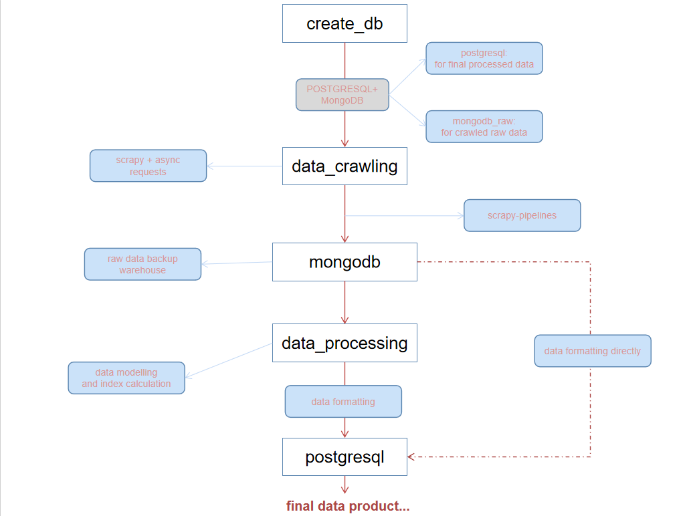
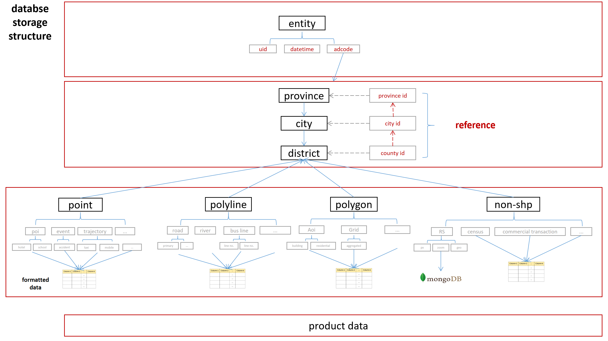

ENGLISH [中文版](./zh-cn.md)

> This version is under developing.

# GeoSQLToolkit: A Spatial-Temporal Data Management Tool Encompassing the Entire Lifecycle from Data Acquisition to Storage

### Introduction

GeoSQLToolkit is a spatial-temporal big data management tool that covers functions ranging from database creation, data acquisition, data processing, and data storage, even to lifecycle management, starting from ground zero. GeoSQLToolkit offers quick and convenient processing methods for common spatial-temporal data tasks (such as mobile signaling data, street view images, road network simplification) in research work. It also provides processing scripts for various general geographic spatial tasks (such as fishnet creation, geocoding).

In summary, GeoSQLToolKit can assist in establishing a comprehensive spatial-temporal database, providing accessible methods for data acquisition and processing commonly used in research work, and formatting the data for storage. This tool can make future research work more convenient and sustainable.

### Key Features

- Database Creation: Establishing a robust, well-designed spatial-temporal database from scratch.
- Data Acquisition: Primarily using web crawling techniques to obtain various types of publicly available internet data, such as POIs, street view images, and population mobility data.
- Data Processing: Cleansing, processing, and modeling a series of raw acquired data to obtain final data results for research objectives.
- Data Storage: Formatting and storing processed data, and exposing user-friendly data interfaces.

### Project Architecture and Technical Details



Currently Learning:

- Kafka: Controlling database throughput, using message queue transmission control during data crawling and storage to reduce database throughput burden, trading time for space.
- Redis: Similar, focusing on learning data structure design concepts.

### Database structure



### A simple startup sample

1. Configure your Database-related softwares (pgsql, mongodb...)

2. input your database params in db_conn.py

```python
class PGConfigs(str, Enum):
    HOST = 'your host'
    PORT = 'your port'
    Database = 'your db'
    User = 'your user name in pgsql'
    Password = 'your pw in pgsql'


# For MongoDB to store raw data
client = MongoClient("your mongo url")
RAW_DB = client["your mongo collection"]

# For PGSQL to store product data
DATA_PRO = create_engine(
    f"postgresql://{PGConfigs.User}:{PGConfigs.Password}@{PGConfigs.HOST}:{PGConfigs.PORT}/{PGConfigs.Database}")
```

3. Open a python file: ./data_collection/boundary/administration_boundaries.py and run the following codes:

```python
if __name__ == "__main__":
    start_time = time.time()
    BoundariesCrawler("province").crawl_boundaries()
    print("--- %s seconds ---" % (time.time() - start_time))
```

4. Now you can see the boundary data was put in your mongoDB.

### Data Content

| Data               | Data Type | Scale           | Region | Source            | Status                           |
| ------------------ | --------- | --------------- | ------ | ----------------- | -------------------------------- |
| Boundary           | Polygon   | City & Province | CN     | Gaode             | Mongo:Completed✅ PG: Developing |
| POI                | Point     | Point           | CN     | Gaode             | /                                |
| AOI                | Polygon   | Polygon         | CN     | Gaode             | /                                |
| mobility           | Graph     | City            | CN     | Baidu             | /                                |
| social-demographic | /         | City            | CN     | Baidu             | /                                |
| Night_Light_Image  | tif       | City(m)         | CN     | Harvard Dataverse | /                                |
| StreetView Image   | png       | Point           | CN     | Baidu             | /                                |

### Disclaimer:

The code is intended for personal studying and research purposes only. Please do not use it for any non-scientific or illegal purposes.

### Contact:

Feel free to contact for technical discussions (kingsleyl0107@gmail.com).
