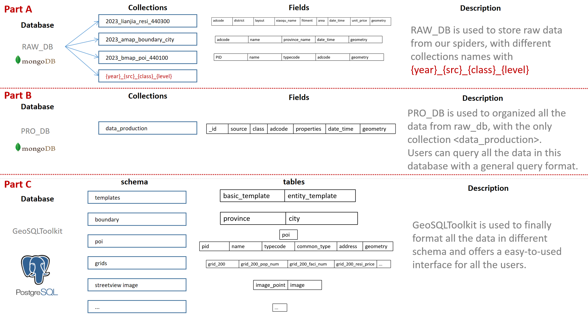
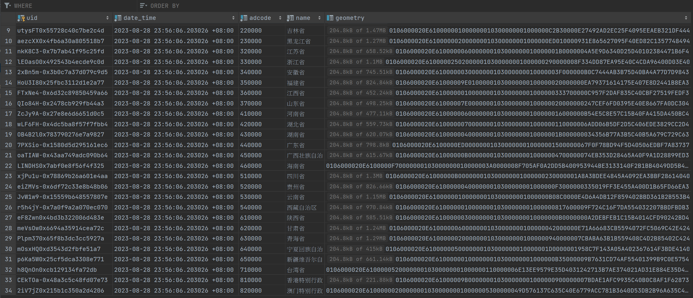

- [GeoSQLToolkit: A Spatial-Temporal Data Management Tool Encompassing the Entire Lifecycle from Data Acquisition to Storage](#geosqltoolkit--a-spatial-temporal-data-management-tool-encompassing-the-entire-lifecycle-from-data-acquisition-to-storage)

  - [Introduction](#introduction)
  - [Key Features](#key-features)
  - [Project Content](#project-content)
    - [Data Collection](#data-collection)
    - [Data Processing](#data-processing)
  - [Database structure](#database-structure)
  - [A simple startup sample](#a-simple-startup-sample)
  - [Disclaimer](#disclaimer)
  - [Contact](#contact)

> This version is under developing.

# GeoSQLToolkit: A Spatial-Temporal Data Management Tool Encompassing the Entire Lifecycle from Data Acquisition to Storage

### Introduction

GeoSQLToolkit is a spatial-temporal big data management tool that covers functions ranging from database creation, data acquisition, data processing, and data storage, even to lifecycle management, starting from ground zero. GeoSQLToolkit offers quick and convenient processing methods for common spatial-temporal data tasks (such as mobile signaling data, street view images, road network simplification) in research work. It also provides processing scripts for various general geographic spatial tasks (such as fishnet creation, geocoding).

In summary, GeoSQLToolKit can assist in establishing a comprehensive spatial-temporal database, providing accessible methods for data acquisition and processing commonly used in research work, and formatting the data for storage. This tool can make future research work more convenient and sustainable.

### Key Features

- Database Creation: Establishing a robust, well-designed spatial-temporal database from scratch.
- Data Acquisition: Primarily using web crawling techniques to obtain various types of publicly available internet data, such as POIs, street view images, and population mobility data.
- Data Processing: Cleansing, processing, and modeling a series of raw acquired data to obtain final data results for research objectives.
- Data Storage: Formatting and storing processed data, and exposing user-friendly data interfaces.

### Project Content

#### Data Collection

| Data                                                                                | Data Type | Scale           | Region | Source            | Status                            |
| ----------------------------------------------------------------------------------- | --------- | --------------- | ------ | ----------------- | --------------------------------- |
| Boundary                                                                            | Polygon   | City & Province | CN     | Gaode             | Mongo:Completed✅ PG: Completed✅ |
| POI                                                                                 | Point     | Point           | CN     | Gaode             | Mongo:Developing                  |
| AOI                                                                                 | Polygon   | Polygon         | CN     | Gaode             | /                                 |
| [mobility strength](https://github.com/kingsley0107/bd_qianxiCrawler "mobility")    | Graph     | City            | CN     | Baidu             | /                                 |
| [social demographic](https://github.com/kingsley0107/Huiyan "socialdemo")           | /         | City            | CN     | Baidu             | /                                 |
| [Night Light Image](https://github.com/kingsley0107/Night_Light_Image "NLI")        | tif       | City(m)         | CN     | Harvard Dataverse | /                                 |
| [StreetView Image](https://github.com/kingsley0107/streetview_images_crawler "NLI") | png       | Point           | CN     | Baidu             | /                                 |

> Now we have finished Boundary and POI is underdeveloping.

#### Data Processing

| Processing Porject                                                                                                        | Processing Object                             | Input          | Output                                                                     | Description                                                                                                                                                                                                                                                      |
| ------------------------------------------------------------------------------------------------------------------------- | --------------------------------------------- | -------------- | -------------------------------------------------------------------------- | ---------------------------------------------------------------------------------------------------------------------------------------------------------------------------------------------------------------------------------------------------------------- |
| [road_regularization](https://github.com/kingsley0107/road_regularization "road_regularization")                          | road                                          | road network   | simplified road network                                                    | Simplify the intricate road network and extract the main roads                                                                                                                                                                                                   |
| [mobile_data_process](https://github.com/kingsley0107/mobile_data_process "mobile_process")                               | signal data(individual with timestamp)        | signal data    | home/work location(grid)                                                   | extracting individual user activities and stay points to detect their residential and work locations                                                                                                                                                             |
| [Urban Renewal Indicator Calculator](https://github.com/kingsley0107/urban_renewal_indices_calculator "urban calculator") | series of urban elements(poi, block, road...) | urban elements | urban indices(density, coverage rate...)                                   | calculating the main indices used in urban planning                                                                                                                                                                                                              |
| [Social Segregation](https://github.com/kingsley0107/social_segregation/tree/master "social segregation")                 | signal data(individual with timestamp)        | signal data    | segregation_indices(PSI) in different prospectives(individual, unit, time) | Reference:[ Xu, Y., Belyi, A., Santi, P. and Ratti, C. Quantifying segregation in an integrated urban physical-social space. Journal of The Royal Society Interface, 16: 20190536. ](https://royalsocietypublishing.org/doi/10.1098/rsif.2019.0536 "social_seg") |
| [Night Light Image Vitality Index ](https://github.com/kingsley0107/Night_Light_Image "NIL")                              | NIL                                           | NIL            | Vitality Index in this NIL                                                 | Calculating the Night Light index in NIL                                                                                                                                                                                                                         |

### Database structure

1. How I organized all the data?
   

2. The structure of postgres --- a easy-to-use interface for users.
   

   Compared to MongoDB, PostgreSQL is a structured database. This implies that data within PostgreSQL needs to be further simplified and refined after retrieval from the MongoDB database. At the same time, it also signifies that users, when accessing data through the data interface, do not need to overly concern themselves with data structure matters. Therefore, utilizing PostgreSQL to provide interfaces for data products offers convenience and user-friendliness

### A simple startup sample

1. Configure your Database-related softwares (pgsql, mongodb...)

2. input your database params in db_conn.py

```python
class PGConfigs(str, Enum):
    HOST = 'your host'
    PORT = 'your port'
    Database = 'your db'
    User = 'your user name in pgsql'
    Password = 'your pw in pgsql'


# For MongoDB to store raw data
client = MongoClient("your mongo url")
RAW_DB = client["your mongo collection"]

# For PGSQL to store product data
DATA_PRO = create_engine(
    f"postgresql://{PGConfigs.User}:{PGConfigs.Password}@{PGConfigs.HOST}:{PGConfigs.PORT}/{PGConfigs.Database}")
```

3. Open python file: ./data_collection/boundary/administration_boundaries.py and run the following codes:

```python
if __name__ == "__main__":
    start_time = time.time()
    # level: 'province' or 'city'.
    BoundariesCrawler(level="province").crawl_boundaries()
    print("--- %s seconds ---" % (time.time() - start_time))
```

4. Run the Python File: ./mongo_raw_to_pro/boundary.py to put the data from RAW_DB to PRO_DB:

```python
if __name__ == "__main__":
    process_province(2023)
    process_city(2023)
```

5. Run the Python File: ./mongo2postgres/boundary.py:

```python

if __name__ == "__main__":
    amap_province(2023)
    amap_city(2023)

```

6. Now you have successfully put the data into your postgres.
   

### Disclaimer

The code is intended for personal studying and research purposes only. Please do not use it for any non-scientific or illegal purposes.

### Contact

Feel free to contact for technical discussions (kingsleyl0107@gmail.com).
