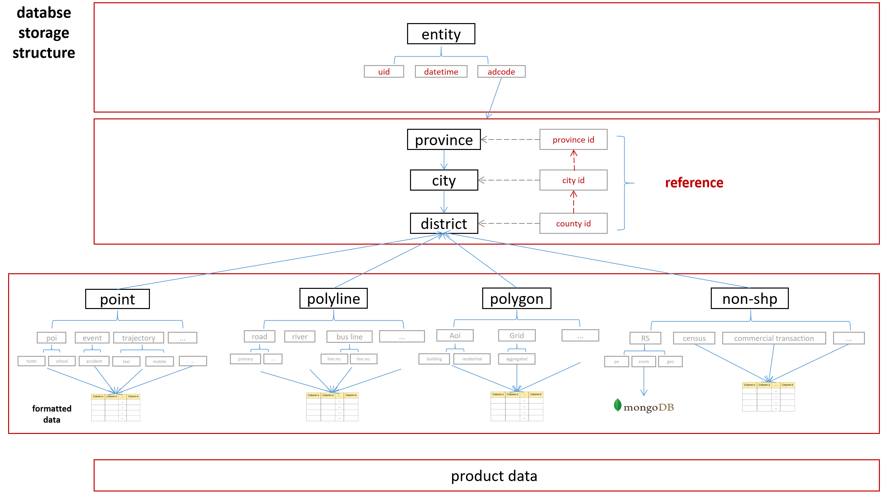

中文版 [ENGLISH](./README.md)

# GeoSQLToolkit 涵盖数据获取、数据处理、数据入库全生命周期的时空数据管理工具

### 简介

GeoSQLToolkit 是一个时空大数据管理工具，其主要涵盖从 0 开始的数据建库、数据获取、数据处理以及数据入库甚至是生命周期管理等的功能。GeoSQLToolkit 为科研工作中常见的时空数据处理(如手机信令数据、街景图像、路网简化)提供了快速简便的处理方法，也为各种通用的地理空间处理(如 fishnet 创建、geocoding 等)提供了处理脚本。

总而言之，GeoSQLToolKit 可以帮助我们创建一个全面的时空数据库，并提供科研工作中常用数据的获取与处理方式，并且格式化入库，可以为我们以后的科研工作变得更加简便与可持续。

### 主要功能

- 数据建库：从零开始创建稳健，合理，well-designed 的时空数据库
- 数据获取：主要通过爬虫技术获取各类互联网公开数据，如 poi、街景图片及人口流动数据等
- 数据处理：将一系列原始获取数据进行数据清洗、处理及建模，获取最终研究目标的数据结果
- 数据入库：将处理后的数据进行格式化入库，并 expose 出简单易用的数据接口

### 项目架构与技术细节

正在学习:

- Kafka:控制数据库吞吐量，数据爬取入库过程中进行消息队列传输量控制，减少数据库吞吐负担，用时间换空间
- redis：类似，关注学习数据结构设计思路

### 数据库存储结构

### Disclaimer：

This crawler code is intended for personal learning and research purposes only. Please do not use it for any non-scientific or illegal purposes.

### Concat:

Feel free to contact for technical discussions(kingsleyl0107@gmail.com)
